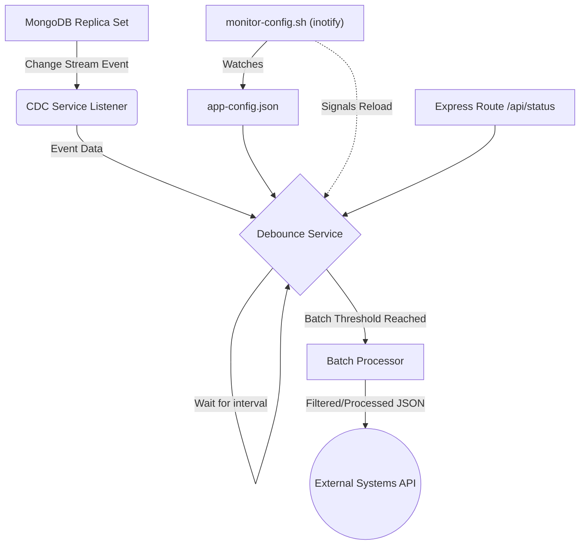

# Change Data Capture (CDC) System

This project is a Complete Change Data Capture (CDC) system built using MongoDB, Node.js, Express, and Shell scripts. It automatically detects database changes (insert, update, delete) and processes them asynchronously using a debouncing mechanism to reduce load.

## Features

- **MongoDB Change Streams:** Captures real-time changes directly from the database oplog / replica set.
- **Node.js Asynchronous Pipeline:** Processes events efficiently without blocking the main event loop.
- **Debouncing Mechanism:** Batches rapid succession events to minimize system and downstream service load.
- **Express.js API:** Provides monitoring endpoints and manual event simulation.
- **Shell Scripts & Unix Inotify:** Filters data and monitors configuration file modifications via the Linux kernel (usable via WSL on Windows).

## System Architecture Diagram



## Event Flow Explanation

1. **Mutation:** A document is created, updated, or deleted in the target MongoDB collection (`users`).
2. **Detection:** The MongoDB Change Stream deployed in the Node.js `cdcService` detects the mutation.
3. **Buffering:** Instead of handling it immediately, `debounceService` adds the event to an internal buffer array.
4. **Debouncing:**
   - If a set time elapses without new events (`debounceIntervalMs`), the buffer is processed.
   - If an influx of rapid events occur, the timer resets until it quiets down, OR until `maxBatchSize` is reached (e.g. 100).
5. **Processing:** The batched events are printed/sent downstream, maintaining eventual consistency while mitigating system strain.
6. **Data Transformation:** You can feed the output JSON into `scripts/filter-data.sh` to scrub sensitive fields (e.g., `password`).

---

## Example Use Cases

- **Data Replication:** Keeping secondary search indexes (like Elasticsearch) or analytics data warehouses synchronized with the primary database.
- **Microservices Communication:** Emitting "User Created" events across Kafka or RabbitMQ so that a Billing or Notification microservice is triggered.
- **Real-time Dashboards:** Pushing metrics to frontend applications using WebSockets.
- **Audit Logging:** Immutably storing who changed what, and when, for security compliance.
- **Cache Synchronization:** Invalidating Redis entries when the underlying MongoDB document changes.

## Large-Scale Stream Integration: Debezium

While this project utilizes native MongoDB Change Streams via Node.js—which is excellent for small/medium applications—enterprise-level architectures often use **Debezium**.

**How Debezium Integrates:**
Instead of a Node.js process `watch()`-ing MongoDB, a Debezium Kafka Connect connector reads the MongoDB `oplog` and publishes events directly to an Apache Kafka topic. Downstream Node.js services would then become Kafka Consumers, completely decoupling the CDC capture process from application logic and offering enormous scalability, fault tolerance, and historic replayability.

---

## Setup Instructions

### 1. MongoDB Replica Set Initialization
Change Streams *require* MongoDB to be configured as a Replica Set.
Start MongoDB with the replSet parameter:
```bash
mongod --dbpath /path/to/data --replSet rs0
```
Then, inside the Mongo shell (`mongosh`), initialize the replica set:
```javascript
rs.initiate()
```

### 2. Install Dependencies
```bash
npm install
```
*(Note: Ensure Node.js and npm are installed on your Windows machine)*

### 3. Run the Project
```bash
npm start
```

### 4. Git Integration & Workflow
Git helps maintain the version history of your configurations:
```bash
git init
git add .
git commit -m "Initial CDC System Implementation"
```
If your `app-config.json` is modified and breaks the application, you can use Git to rollback:
```bash
git checkout HEAD -- config/app-config.json
```

---

## Testing

**API Testing via cURL:**

Get System Status:
```bash
curl http://localhost:3000/api/status
```

Simulate an Insert Event:
```bash
curl -X POST http://localhost:3000/api/simulate \
-H "Content-Type: application/json" \
-d '{"operationType":"insert","targetCollection":"users","documentId":"12345","data":{"name":"Jane Doe"}}'
```

**Testing Shell Scripts (requires WSL on Windows):**
To monitor configuration files for updates:
```bash
cd scripts
chmod +x monitor-config.sh
./monitor-config.sh
# Open config/app-config.json in another window and modify it.
```

---

## Runtime Behavior & Safety

- **Config defaults & validation:** The service reads `config/app-config.json` but will automatically fall back to safe defaults (`debounceIntervalMs = 5000`, `maxBatchSize = 100`, `targetCollection = "users"`) if the file is missing or invalid.
- **Graceful shutdown:** On process signals (e.g. `CTRL+C`), the server closes the MongoDB Change Stream, disconnects from MongoDB, and then stops the HTTP server to avoid dangling connections.
